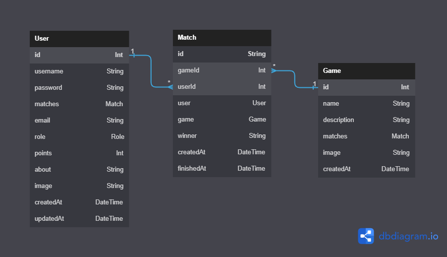

<div align="center">
    </a>
    
</div>

<div align="center">
    
    
    
    
    <br>
    
</div>

---

## Online Mini Games Platform

Description: Game platform where there will be several options to compete against the machine. Users will enter the page and have the option to log in or play anonymously. In addition, it will have an API that provides the data of registered users.

### Frontend Info

- Build and run the website

```
cd src/website
npm i
npm run build
npm run start
```

- Project Structure

```sh
.
├── src/
│   ├── stylesheets/
│   ├── hooks/
│   ├── helpers/
│   ├── context/
│   ├── components/
│   │   ├── shared/
│   │   ├── pages/
│   │   │   └── configuration/
│   │   └── main/
│   │       └── App/
│   │           ├── Top/
│   │           ├── RouterSwitch/
│   │           ├── PromotionalHeader/
│   │           ├── Player/
│   │           ├── Modal/
│   │           ├── ListPlayer/
│   │           ├── Home/
│   │           ├── Header/
│   │           ├── Games/
│   │           ├── Footer/
│   │           └── Account/
│   ├── react-app-env.d.ts
│   ├── index.tsx
│   └── App.tsx
├── public/
│   └── assets/
│       └── images/
│
├── tsconfig.json
├── package.json
├── package-lock.json
├── .prettierrc.yaml
├── .gitignore
└── .eslintrc.json
```

### Backend Info

- Build and run the API

1. Create an .env file in the same folder as the .env.example
2. Fill it with your own settings (.env.example is a guide)
3. Execute the following commands

```
cd src/api
npm i --omit=dev
npm run build
npx prisma migrate deploy
npx prisma db seed
npm run start
```

For development mode

```
npm i
npm run watch
npm run dev (in other console)
```
- Project schema



- Project Structure
```sh
.
├── src/
│   ├── utils/
│   ├── tests/
│   ├── services/
│   ├── routes/
│   ├── middlewares/
│   ├── controllers/
│   ├── configuration/
│   ├── client/
│   ├── server.ts
│   └── index.ts
├── public/
│   ├── images/
│   ├── games/
│   └── health.txt
├── prisma/
│   ├── migrations/
│   ├── dbml/
│   ├── seed.ts
│   └── schema.prisma
├── build/
│   ├── src/
│   └── prisma/
├── tsconfig.json
├── package.json
├── package-lock.json
├── .prettierrc.json
├── .gitignore
├── .eslintrc.json
├── .env.example
└── .env
```
